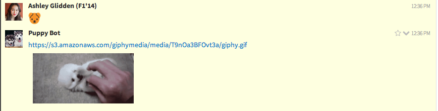

puppyMeBot
==========

A Zulip Bot that responds to the dog emojis with adorable puppy gifs on Hacker School's internal chat program. 

The bot recognizes all three of the dog emojis, :dog:, :dog2:, :doge:, and responds with a random "cute puppies" gif from the GIPHY API. As shown below:

